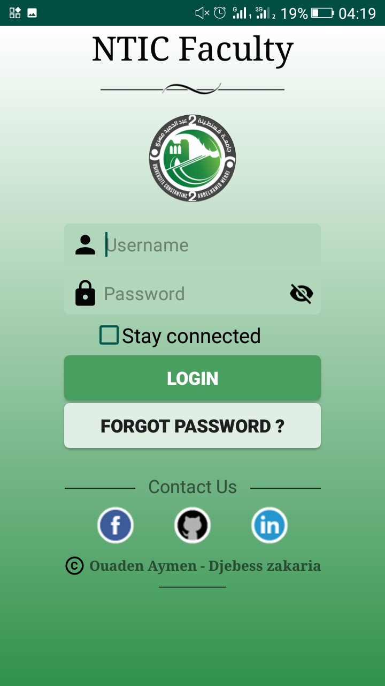
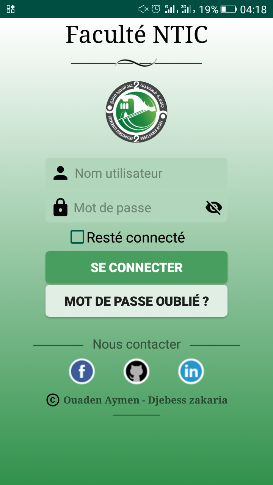
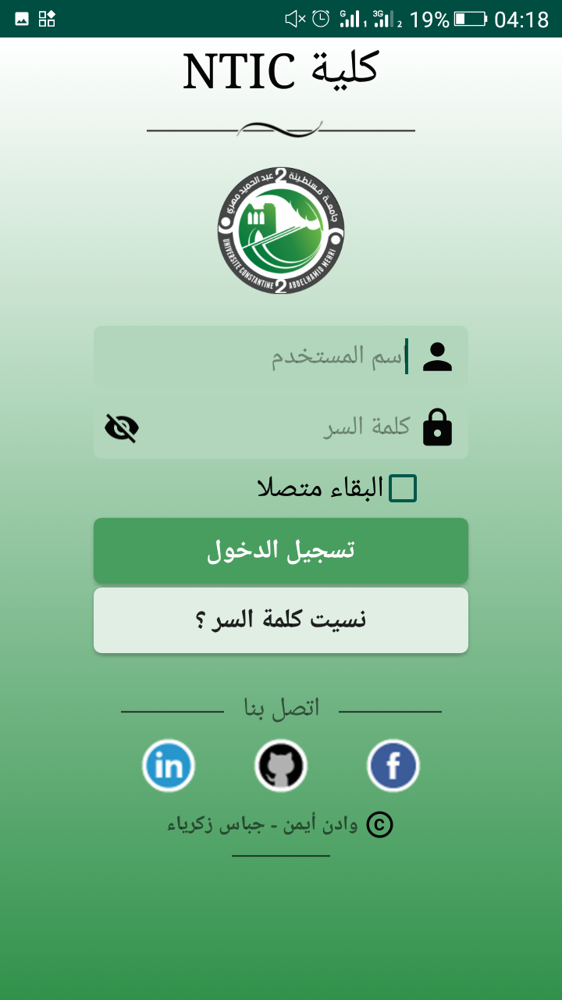

	<link rel="stylesheet" href="https://cdn.jsdelivr.net/npm/bootstrap@4.6.0/dist/css/bootstrap.min.css" integrity="sha384-B0vP5xmATw1+K9KRQjQERJvTumQW0nPEzvF6L/Z6nronJ3oUOFUFpCjEUQouq2+l" crossorigin="anonymous">

# NTIC_Android

 • Outils logiciel
 Les différents logiciels et technologies utilisés pour le développement de notre application mobile sont :

1. Android studio : Android studio version 3.5.2, Gradle version : 5.4.1
   Android Studio est un environnement de développement pour développer des applications mobiles Android. Il est basé sur IntelliJ IDEA et utilise le moteur de production Gradle. Il peut être téléchargé sous les systèmes d'exploitation Windows, macOS, Chrome OS et Linux. Il permet de faciliter le développement en offrant différents outils et fonctionnalités. Pour l’installer il est nécessaire d’installer le kit de développement Android SDK et le kit de développement JDK.

2. Android SDK

- Cet environnement fournit les outils nécessaires au développement d’applications Androïdes. Ses principales fonctionnalités sont :
- Un explorateur il permet d’explorer les dossiers des projets créés sur ce programme, sous forme d'arborescence affichée sur l’interface principale.
- Un éditeur : facilite l’édition et le traitement du code avec des fonctionnalités avancées, tel que la coloration de syntaxes relatives aux langages de programmation utilisés pour détecter plus facilement les erreurs, et l’auto-complétion.
- Un émulateur : permet de tester le code saisi, sur un terminal virtuel pour visualiser l’application codée.

3. JDK (Java Development Kit)
   Désigne un ensemble de bibliothèques logicielles de base du langage de programmation Java, ainsi que les outils avec lesquels le code Java peut être compilé, transformé en bytecode destiné à la machine virtuelle Java.

   • Bibliothèques

1. SQLite :
   SQLite est une bibliothèque écrite en langage C qui propose un moteur de base de données relationnelle accessible par le langage SQL. Contrairement aux serveurs de bases de données traditionnels, comme MySQL, sa particularité est de ne pas reproduire le schéma habituel client-serveur mais d'être directement intégrée aux programmes. L'intégralité de la base de données (déclarations, tables, index et données) est stockée dans un fichier indépendant de la plateforme.
1. Retrofit :
   Retrofit est une librairie permettant de réaliser des appels à des web services REST sur Android de la façon la plus simple qui soit. Elle a été développée par le groupe Square
1. RecyclerView:
   RecyclerView est un « ViewGroup » qui restitue toute vue basée sur un adaptateur de la même manière. Il est censé être le successeur de « ListView » et « GridView ». L'une des raisons est que RecyclerView a un cadre plus extensible, d'autant plus qu'il offre la possibilité d'implémenter des mises en page horizontales et verticales. On utilise RecyclerView lorsqu’on a des collections de données dont les éléments changent au moment de l'exécution en fonction de l'action de l'utilisateur ou des événements réseau.
1. CardView :
   Introduit un nouveau composant appelé "CardView", qui est essentiellement un conteneur rectangulaire avec quatre coins arrondis, et un effet ombré aux frontières."CardView" est souvent utilisé comme conteneur racine pour les items dans "ListView","GridView" ou "RecyclerView".
1. SDP : (Unité de taille)
   Une bibliothèque qui fournit une nouvelle unité de taille - Sdp (Scalable dp). Cette unité de taille s'adapte à la taille de l'écran. Elle aide les développeurs Androïdes à développer des applications qui prendre en charge plusieurs écrans.
1. Zxing :
   Une bibliothèque qui prend en charge le décodage et la génération de codes-barres (comme: QR Code, PDF 417, EAN, UPC, Aztec ....) au sein des images.
1. MPAndroidChart
   Il s'agit d'une bibliothèque de vues de graphiques Androide gratuite à l'aide de laquelle vous pouvez dessiner des graphiques en ligne, à barres, à secteurs, en radar, à bulles et en chandeliers.
1. JavaMail
   JavaMail permet d'utiliser le courrier électronique (e-mail) dans une application écrite en Java .Androide ne fournit pas de distribution JavaMail standard compatible Java. Au lieu de cela, une version spéciale de JavaMail est disponible pour Android. Cette version spéciale de JavaMail dépend d'une version spéciale de JavaBeans Activation Framework. Cette version est disponible à partir du java.net « maven repository»
1. PhotoView
   vise à aider à produire une implémentation facilement utilisable d'un zoom d’image.
   2- L’application
   L’application mobile est développé pour la version d’androïde 6.0 « Marshmallow» API niveau 23 qui a été réalisé en 2015, mais pour rendre l’application plus compatible et satisfaire la majorité des enseignants et étudiants, les fonctionnalités de l’application sont accessibles depuis la version « KitKat » API niveau 19 qui à été réalisé en 2013, pour ces versions se peut produire quelques anomalies au niveau d’affichage(exemple: les « CardView » sont supportés depuis la version 5.0 d’androïde API niveau 21). L’application supporte trois langues : le français, l’arabe et l’anglais, et s’adapte automatiquement avec toutes les résolutions des écrans supporté par le système androïde.
   Toutes les fonctionnalités de notre système sont disponibles au niveau de notre application. A propos du cas essentiel « prise des absences », on a mis trois méthodes pour rendre cette tache plus facile et cohérente, la première c’est la prise des absences manuellement.la deuxième méthode du code QR est réalisé a l’aide de la bibliothèque «Zxing», le principe de déroulement est le suivant :

- L’enseignant choisis la séance puis clique sur le bouton « généré code QR ». le code QR sera stocké dans la base de données et tous les étudiants de cette séance seront enregistrés absents sauf celles qui ont un congé académique valide.
- Les étudiants qui scannent le code correctement dans le délai déterminé par l’enseignant appellent une méthode qui supprime leurs absences.
- Une fois l’enseignant clique sur le bouton « terminer l’opération », le code QR sera supprimé depuis la base de données et le système ne prend en considération aucun nouveau scannage.
  Et dans la dernière méthode, on a pris en considération le cas de mauvaise connexion internet, cette méthode est basée essentiellement sur la bibliothèque « SQLite » selon le principe suivant :
- L’enseignant accède au mode hors-ligne et entre son identificateur, le jour et l’heure de la séance. Puis il ajoute les identifiants des étudiants absents. Ces absences sont enregistrées localement dans le téléphone à l’aide d’une base de données SQLite. Ces dernières données resteront jusqu'à que l’enseignant télécharge la liste des absences vers le serveur ou efface les données de l’application manuellement depuis les paramètres.
- Lorsque l’enseignant connecte correctement à l’application, il peut télécharger la liste des absences vers le serveur en cliquant sur le bouton « importer liste d’absences », les absences seront effacées automatiquement depuis la base de données SQLite.

Connexion en trois langues:
  
